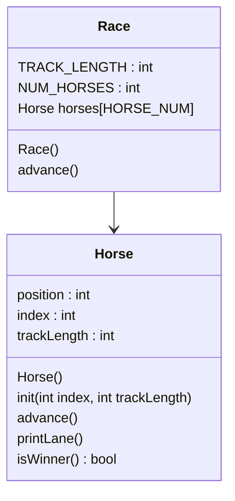

# CS121-OOP-Horse-Race
## CS121_C Week 5
### An array of five horses start at position 0 and race to the finish line. First horse to finish wins.  


## Race()
```
in header
    const static int NUM_HORSES gets 5
    constant int TRACK_LENGTH gets 15
in constructor
    go through each horse
    initialize horse by calling it's init
```
## Race.start()
```
bool keepGoing gets true
while keepGoing:
    for each horse, 
        advance the horse
        print lane
        if horse wins:
            keepGoing gets false
```
## Horse::Horse()
```
position gets 0
index gets 0
track_length gets 15
```
## Horse::init(int index, int trackLength){
```
my index gets index
my trackLength gets trackLength
my position gets 0
```
## Horse::advance()
```
random 0-1 int is rolled; int 'coin' gets int
add coin to position
```
## Horse::printLane()
```
for position from 0 to track length:
    if position is equal to my position,
        print index
    else,
        print "."
print newline
```
## bool Horse::isWinner()
```
bool result gets false
if position is greater than or equal to trackLength,
    result gets true
    print congratulations for horsey winner
return result
```

